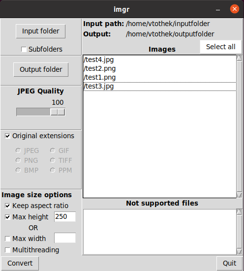

# imgr
##  A bulk image resizer with Tkinter GUI

Lets resize a few images of different filetype. Our test images are located in `~/inputfolder`.

```bash
vtothek@ubuntu ~/inputfolder $ file *
test1.png: RIFF (little-endian) data, Web/P image, VP8 encoding, 390x280, Scaling: [none]x[none], YUV color, decoders should clamp
test2.png: PNG image data, 800 x 600, 8-bit/color RGBA, non-interlaced
test3.jpg: JPEG image data, Exif standard: [TIFF image data, big-endian, direntries=11, manufacturer=NIKON CORPORATION, model=NIKON D300, orientation=upper-left, xresolution=9236, yresolution=9244, resolutionunit=2, software=Bibble 4.10.1, datetime=2009:05:24 16:32:41, copyright=, GPS-Data], baseline, precision 8, 4304x2860, components 3
test4.jpg: PNG image data, 920 x 736, 4-bit colormap, non-interlaced
```

Let's select the `~/inputfolder` as our input folder from the UI, and select `~/outputfolder` as the output folder where to put the resized images. Let's also select that we choose to keep the original file extensions and we want to limit the image height to 250 px while preserving aspectratio. Let's also choose all images from the input folder for resizising. 

Like so:



Then click Convert and check the results from `~/outputfolder`. imgr will always create a folder where it stores the resized files, the folders name is always the system time of the resizing.

```bash
vtothek@ubuntu ~/outputfolder/2022-01-01 13:16:26 $ file *
test1.png:  RIFF (little-endian) data, Web/P image, VP8 encoding, 348x250, Scaling: [none]x[none], YUV color, decoders should clamp
test2.png:  PNG image data, 333 x 250, 8-bit/color RGBA, non-interlaced
test3.jpeg: JPEG image data, JFIF standard 1.01, aspect ratio, density 1x1, segment length 16, baseline, precision 8, 376x250, components 3
test4.png:  PNG image data, 312 x 250, 4-bit colormap, non-interlaced
```

And so we have resized images. 


## About this project
This project was started in mind to learn about Python and Tkinter in general. Looking back at this project, the code is pretty awful and unmaintainable.

### Main take aways:
* Python threading is a complete joke. Concurrent image resizing? How about 50% performance decline in return.

The program works and does what it is supposed to do (and is pretty fast too), but i have no interest in upkeeping this mess. Fork and refactor the living out of this if you wish. Or just use it to resize your images.

